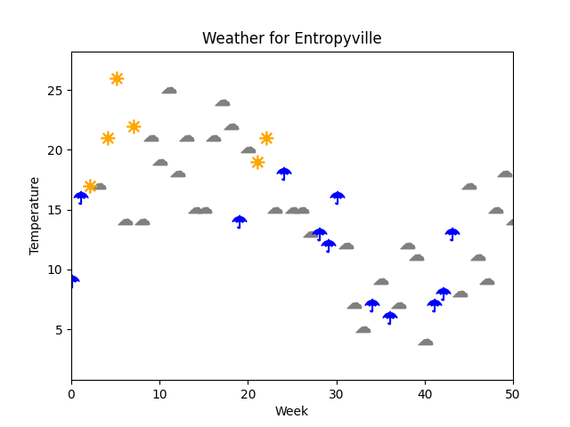

Even though `ennemi` was originally designed to handle continuous variables,
it can estimate MI between discrete variables as well.
Very usefully, it can also estimate the dependence between discrete and continuous variables.

In this tutorial, we will apply `ennemi` to a very simplified example.
You can download the [source code for this example](discrete_example.py)
to play with the model.


## A very simple weather model

In the fictional town of Entropyville, the weather is very straightforward:
either it rains, is partly cloudy, or is perfectly clear.



The weather is fairly stable, and as such it is enough to look at weekly values.
We have 200 weeks of weather data at our disposal, stored in a `pandas` data frame:

```python
print(data)
```
```
    Weather  Temp   Press Wind
0     rainy   9.0  1002.0    W
1     rainy  16.0  1008.0    N
2     clear  17.0  1028.0    E
3    cloudy  17.0  1027.0    S
4     clear  21.0  1030.0    W
..      ...   ...     ...  ...
195  cloudy  11.0  1031.0    S
196  cloudy  14.0  1021.0    N
197  cloudy  14.0  1002.0    N
198   rainy  10.0   998.0    W
199   rainy  19.0   990.0    W
```

Let's start finding out how to forecast the next week!


## Note for `pandas` users

String data in a `pandas` data frame must be fixed up.
**This step is not necessary with raw NumPy arrays.**

The problem is that `pandas` stores strings internally as the `object` data type.
This data type cannot be used in the estimation of MI.
We can convert the categories to integers to fix the problem.

```python
# Not the most optimal code, but sufficient in small example
data2 = data.drop(columns=["Weather", "Wind"])

data2["Wind"] = 0
data2.loc[data["Wind"] == "E", "Wind"] = 1
data2.loc[data["Wind"] == "S", "Wind"] = 2
data2.loc[data["Wind"] == "W", "Wind"] = 3

data2["Weather"] = 0
data2.loc[data["Weather"] == "cloudy", "Weather"] = 1
data2.loc[data["Weather"] == "clear", "Weather"] = 2

print(data2)
print(data2.dtypes)
```

This outputs

```
     Temp   Press  Wind  Weather
0     9.0  1002.0     3        0
1    16.0  1008.0     0        0
2    17.0  1028.0     1        2
3    17.0  1027.0     2        1
4    21.0  1030.0     3        2
..    ...     ...   ...      ...
195  11.0  1031.0     2        1
196  14.0  1021.0     0        1
197  14.0  1002.0     0        1
198  10.0   998.0     3        0
199  19.0   990.0     3        0

[200 rows x 4 columns]
Temp      float64
Press      float64
Wind         int64
Weather      int64
dtype: object
```


## Correlation between measurements and weather

From the figure, it appears likely that temperature has a big role in the weather.
Here the two variables are mixed:

- Temperature is **continuous**: it ranges roughly between 0 and 30 degrees (C).
  Even though the measured values are rounded to whole numbers, we can think
  of its values as an unbroken scale.
- Weather is **discrete**: it is divided into three categories.
  We have to assume that there are no in-between values; the data does not give more details.

`ennemi` can estimate the MI of a discrete-continuous pair just fine,
but we have to be careful in its interpretation.
The first part is no harder than:

```python
print(estimate_mi(data2["Weather"], data2[["Temp", "Press"]], discrete_y=True))
```
Note that we passed the `discrete_y` parameter to indicate that `Weather` is a discrete variable.
(Perhaps confusingly, `ennemi` calls the first parameter `y` and the second `x`.
This is because `y` is the variable of interest, and multiple covariates may be passed in `x`.)

The code prints

```
       Temp    Press
0  0.092366  0.07407
```

But what do these numbers mean?
We did not pass `normalize=True`, so it is not a correlation coefficient.
Neither would that parameter help, because it would assume both variables to be continuous.

We have to go back to the [theoretical background of MI](what-is-entropy.md).
MI is measured in _nats_, an unit of information.
It tells us how much _information_ we have about `Weather` given that we know `Temp` or `Press`.
So the question should be: how much information there is to know?

We can estimate the information content, also known as _entropy_, of `Weather` by calling

```python
print(estimate_entropy(data2["Weather"], discrete=True))
```
```
    Weather
0  0.905266
```

That is, out of the 0.91&nbsp;nats of information, temperature provides only 0.092&nbsp;nats,
and air pressure even less.

**Note:** The entropy of a continuous variable is interpreted very differently.
In particular, one cannot compare ratios of entropies like we do below.


## Conditioning on the other variable

We can use conditioning to answer the question:
> If I already know the temperature, how much _extra_ information on weather does air pressure give?

This is done by passing the temperature as a conditioning variable:

```python
print(estimate_mi(data2["Weather"], data2["Press"], cond=data2["Temp"], discrete_y=True))
```

The amount of information has increased:

```
      Press
0  0.144797
```

What does this mean, then?
Recall that the temperature alone gave 0.092&nbsp;nats of information.
Knowing also the air pressure gives 0.145&nbsp;nats more &ndash; meaning that the total knowledge
is already 0.237&nbsp;nats.
Together, the two variables explain 26&nbsp;% of the weather.

In the literature, this is also known as the _uncertainty coefficient_.


## Correlation between wind direction and weather

Let us consider another pair of variables for a moment:
the wind direction might have something to do with the weather too.

```python
print(estimate_mi(data2["Weather"], data2["Wind"], discrete_y=True, discrete_x=True))
```

Now we passed the `discrete_x` parameter to mark the `Wind` variable as discrete too.
(For the time being, `estimate_mi` does not allow mixing continuous and discrete `x` covariates.)

The results are very promising:
```
       Wind
0  0.533151
```

Wind direction alone seems to explain most (59&nbsp;%) of the randomness in weather.
Moreover, wind at Entropyville seems to be independent of the other measures:

```python
print(estimate_mi(data2["Wind"], data2[["Temp", "Press"]], discrete_y=True))
```
```
       Temp     Press
0  0.026497 -0.008977
```

The values are practically zero.
(Even though MI is always non-negative, `ennemi` passes the estimation error through.
This explains the negative value for the air pressure.)


## Limitations in conditioning

It would be tempting to repeat the previous exercise of conditioning.
However, this code gives a warning:

```python
print(estimate_mi(data2["Weather"], data2["Wind"],
      cond=data2[["Temp","Press"]], discrete_y=True, discrete_x=True))
```
```
UserWarning: A discrete variable has relatively many unique values. Have you set marked the discrete variables in correct order? If both X and Y are discrete, the conditioning variable cannot be 
continuous (this limitation can be lifted in the future).
```

As of version 1.3, `ennemi` supports only these combinations of variables and conditions:

| | No condition | Discrete | Continuous | Both types in 2D condition |
| --- | --- | --- | --- | --- |
| Discrete-discrete | ✔️  | ✔️  | ❌ | ❌ |
| Discrete-continuous | ✔️ | ❌ | ✔️ | ❌ |
| Continuous-continuous | ✔️ | ❌ | ✔️ | ❌ |

Future versions of `ennemi` may implement the estimation for more combinations.

Luckily for our example, we already got a lot of information:

- Wind direction gives 0.53&nbsp;nats;
- Air pressure and temperature together give 0.24&nbsp;nats;
- There is little to no overlap between these two.

That is, we have explained 85&nbsp;% of the variation in weather.
The remaining 0.14&nbsp;nats give fairly little random variation:
they correspond roughly to getting 1 on a 30-sided die.


## Pairwise correlations

For completeness, let us redo the individual estimates in a more efficient manner.
The `pairwise_mi` method is designed to give an efficient overview of the variable relations.

```python
print(pairwise_mi(data2, discrete=[False, False, True, True]))
```

Here the `discrete` parameter corresponds to the columns of the data frame.
The output is a matrix of pairwise MIs:

```
             Temp     Press      Wind   Weather
Temp          NaN -0.031239  0.026497  0.092366
Press   -0.031239       NaN -0.008977  0.074070
Wind     0.026497 -0.008977       NaN  0.533151
Weather  0.092366  0.074070  0.533151       NaN
```

In particular, the last column (or row) gives the values that we calculated earlier.
We also see that the other variables are independent of each other.

**On interpretation:**
The matrix entries corresponding to continuous-continuous variable pairs
should be interpreted differently to the others.
In particular, they should be converted to a correlation coefficient.
As correlation coefficients and MI values cannot be directly compared,
`ennemi` does not do this automatically.

**Conditioning:** Due to the limitations mentioned above,
`pairwise_mi` does not support conditioning when the data contains both
discrete and continuous variables.


## Conclusion

Even though this was a silly toy example with generated data
(and a very unrealistic model of weather!),
we went through the relevant estimation methods.
We also discussed one way of interpreting the data.

In this tutorial, we did not look into autocorrelation, time lags, or masking.
These features work just as in the [general tutorial](tutorial.md).
