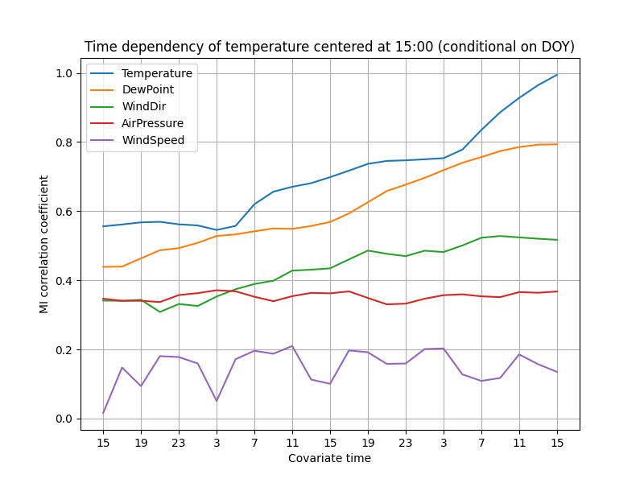

This example demonstrates the steps of one possible analysis workflow with `ennemi`.
We analyze meteorological data from the Kaisaniemi measurement station in Helsinki, Finland.
This data is available from Finnish Meteorological Institute under the CC-BY&nbsp;4.0 license.
([Original data source](https://en.ilmatieteenlaitos.fi/download-observations).)

To follow this example, please download the [kaisaniemi.csv](kaisaniemi.csv) data set.
This file is already tidied up, and contains measurements of five variables between 2015 and 2019
and a "day of year" column.
You can also download the [complete analysis script](kaisaniemi_casestudy.py).


## Preprocessing the data
Let's start by importing the data; nothing special here.
We use the `pandas` library for data manipulation.

```python
from ennemi import estimate_corr, pairwise_corr
import matplotlib.pyplot as plt
import numpy as np
import pandas as pd

# The first column contains a datetime index
data = pd.read_csv("kaisaniemi.csv", index_col=0, parse_dates=True)
print(data.head())
```

The last line prints a preview of the data set.
The temperatures are in degrees Celsius,
the air pressure is in hehtopascals (millibars) and the wind speed in meters per second.

```
                     AirPressure  Temperature  DewPoint  WindDir  WindSpeed  DayOfYear
2015-01-01 00:00:00       1010.6          4.1       3.1    290.0        3.7       1.00
2015-01-01 01:00:00       1010.5          4.2       3.1    284.0        3.4       1.04
2015-01-01 02:00:00       1010.5          3.6       2.8    285.0        3.3       1.08
2015-01-01 03:00:00       1010.1          3.3       2.8    282.0        2.8       1.12
2015-01-01 04:00:00       1009.7          3.6       2.7    267.0        3.5       1.17
```

To make the MI estimation more accurate, we should ensure that the variables have
roughly symmetric distributions.
By visual inspection (not shown here), we don't need to transform anything.
`ennemi` automatically rescales the variables to unit variance and
adds low-amplitude noise (with fixed random seed) by default.
The reasons for these steps are discussed on the [Potential issues page](potential-issues.md).

As a final preprocessing step, we create a mask that selects only the observations
at 15:00 local time (13:00 UTC).
This is necessary to both focus the investigation and to avoid issues with autocorrelation.

```python
afternoon_mask = (data.index.hour == 13)
```


## Pairwise MI between variables

To get an overview of the dependencies between variables, we create a pairwise MI plot.
This is a matrix where the rows and columns correspond to variables.
`ennemi` includes a `pairwise_corr()` method for this purpose.
This method returns values on a correlation
coefficient scale (0 to 1, sign of correlation not determined).

```python
pairwise = pairwise_corr(data, mask=afternoon_mask)

# Plot a matrix where the color represents the correlation coefficient.
# We clip the color values at 0.2 because of significant random noise,
# and at 0.8 to make the color constrast larger.
fig, ax = plt.subplots(figsize=(8,6))
mesh = ax.pcolormesh(pairwise, vmin=0.2, vmax=0.8)
fig.colorbar(mesh, label="MI correlation coefficient", extend="both")

# Show the variable names on the axes
ax.set_xticks(np.arange(len(data.columns)) + 0.5)
ax.set_yticks(np.arange(len(data.columns)) + 0.5)
ax.set_xticklabels(data.columns)
ax.set_yticklabels(data.columns)
ax.set_title("Unconditional MI at 15:00 local time")

plt.show()
```


Obviously, the day of year correlates strongly with temperature.
What if we deseasonalized the data and only looked at differences to the ordinary cycle?
With MI, this is done by conditioning on one or more variables;
in our case this variable is DayOfYear.

```python
# Now we pass the 'cond' parameter
pairwise_doy = pairwise_corr(data, mask=afternoon_mask,
    cond=data["DayOfYear"])

# The same plotting code as above
fig, ax = plt.subplots(figsize=(8,6))
mesh = ax.pcolormesh(pairwise_doy, vmin=0.2, vmax=0.8)
fig.colorbar(mesh, label="MI correlation coefficient", extend="both")

ax.set_xticks(np.arange(len(data.columns)) + 0.5)
ax.set_yticks(np.arange(len(data.columns)) + 0.5)
ax.set_xticklabels(data.columns)
ax.set_yticklabels(data.columns)
ax.set_title("Conditional on day of year, at 15:00 local time")

plt.show()
```


As a consistency check, the correlations with day of year are now zero.
(With unscaled data, there would actually remain quite significant noise.)
The correlation between air pressure and temperature is now weaker,
suggesting that it was partly caused by seasonal cycles of the two variables.

On the other hand, the correlation between wind direction and temperature is stronger
&ndash; this suggests that the wind explains variation within a season.
If you want to see why, try drawing a scatter plot of the two variables
restricted to January and July.

The lowest correlation values may contain random noise.
The transformation from raw MI to correlation coefficient scale is non-linear
and therefore noise has stronger effect in the low correlation values.
This is demonstrated more in the next steps.


## Time dependency

How does temperature depend on past observations of the variables?
We can answer this question with the time lag feature of `estimate_corr()`.
We calculate the correlation between "temperature now" and
"[other variable] [0, 2, ..., 48] hours ago".
Again, the temperature observations are fixed at 15:00.

```python
# These are in decreasing order on the plot
covariates = ["Temperature", "DewPoint", "WindDir", "AirPressure", "WindSpeed"]

# Lag up to two days with 2-hour spacing
lags = np.arange(0, 2*24 + 1, 2)
temp = estimate_corr(data["Temperature"], data[covariates], lags,
    cond=data["DayOfYear"], mask=afternoon_mask)

# Plot the MI correlation coefficients as a line plot
fig, ax = plt.subplots(figsize=(8,6))
lines = ax.plot(temp)

# To make the results easier to interpret, display time points
# instead of lag values on the x axis. Only display every other time point.
ax.set_xticks(lags[::2])
ax.set_xticklabels([f"{(15-i) % 24}" for i in lags[::2]])
ax.invert_xaxis()

ax.set_xlabel("Covariate time")
ax.set_ylabel("MI correlation coefficient")
ax.set_title("Time dependency of temperature at 15:00 (conditional on DOY)")
ax.legend(lines, covariates)
ax.grid()

plt.show()
```


The correlations decay fairly slowly, suggesting that the weather does not change rapidly.
The correlation with air pressure even increases a little as the time passes.
The autocorrelation of temperature decreases as the time difference increases,
and probably approaches zero after a few days.

Wind speed has probably the most surprising pattern.
Unfortunately, this is probably due to random noise.
The 1826 days of observations in the data set are not sufficient
for reliable estimation of low correlations (coefficient roughly 0 to 0.2).


## Improving accuracy

To increase accuracy of low correlations, the `k` parameter should be increased.
This might cause a slightly larger error in larger correlations.
Another way is to increase the effective sample size by averaging several runs.

Because the variables are so strongly autocorrelated,
successive observations cannot be used together.
However, it also allows us to assume that
the temperatures at 14:00, 15:00 and 16:00 (local time) follow the same distribution.
We can therefore repeat the estimation with two more masks.

```python
# Use two more masks, higher k, and average of the three runs
temp_12 = estimate_corr(data["Temperature"], data[covariates], lags, k=8,
    cond=data["DayOfYear"], mask=(data.index.hour == 12))
temp_13 = estimate_corr(data["Temperature"], data[covariates], lags, k=8,
    cond=data["DayOfYear"], mask=afternoon_mask)
temp_14 = estimate_corr(data["Temperature"], data[covariates], lags, k=8,
    cond=data["DayOfYear"], mask=(data.index.hour == 14))

temp_avg = (temp_12 + temp_13 + temp_14) / 3

# The same plotting code as above
fig, ax = plt.subplots(figsize=(8,6))
lines = ax.plot(temp_avg)

ax.set_xticks(lags[::2])
ax.set_xticklabels([f"{(15-i) % 24}" for i in lags[::2]])
ax.invert_xaxis()

ax.set_xlabel("Covariate time")
ax.set_ylabel("MI correlation coefficient")
ax.set_title("Time dependency of temperature centered at 15:00 (conditional on DOY)")
ax.legend(lines, covariates)
ax.grid()

plt.show()
```



The lines are now smoother, especially in the lower correlations.
It seems more plausible that the temperature really is independent of the wind speed
36 hours ago, but the same does not hold for the 24-hour delay.

By some statistical theory, averaging 3 estimations should reduce the uncertainty
to $1/\sqrt{3} \approx 0.6$ of the original,
assuming that the distributions are approximately equal.

Given this result, it would probably make sense to update the pairwise MI plots
with averaging as well.
We leave that, and an implementation of averaging without copy-pasting,
as an exercise to the reader.
The next step would then be to draw some scatter plots of the variables and start building a theory!
