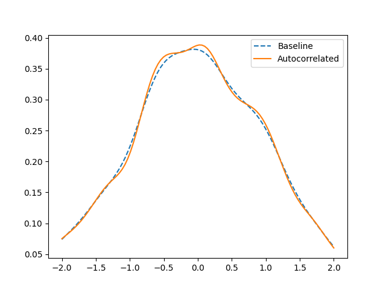

There are a few things you should know when using `ennemi` in your projects.
In case you encounter an issue not mentioned here, please get in touch!


## Negative MI

`estimate_mi()` might return a negative number near zero (like -0.03).
You should first check that:

- If at least one variable is discrete/categorical,
  you have set the `discrete_x` and/or `discrete_y` parameter.

Mathematically, mutual information is always non-negative,
but the continuous-case estimation algorithm is not exact.
Some estimation error is expected, especially with small sample sizes.

Near-zero values can thus be interpreted as zero.
However, if the result is further from zero (something like `-0.5`, or even `-inf`),
that certainly is an issue.
Some possible causes are explained below.


## Skewed or high-variance distributions
Mutual information is invariant under strictly monotonic transformations.
Such transformations include
- For all variables: addition with a constant,
  multiplication with a non-zero constant and exponentiation;
- For positive variables: logarithm, powers and roots.

However, with sample sizes less than $\infty$,
the estimation algorithm may produce different results
between original and transformed variables.
For this reason it is recommended to scale the variables to have
roughly symmetric distributions.
This transformation will not change the actual MI,
but will improve the accuracy of the estimate.

Entropy is not transformation-invariant, and therefore this guidance
does not apply to `estimate_entropy()`.

For example, here is the bivariate Gaussian example modified to be
lognormal in both marginal directions,
with greater variance in the `x` variable.
As mentioned in the tutorial, $\mathrm{MI}(X, Y) \approx 0.51$ and
the exponentiation does not change this.
```python
from ennemi import estimate_mi
import numpy as np

rng = np.random.default_rng(1234)
rho = 0.8
cov = np.array([[1, rho], [rho, 1]])

data = rng.multivariate_normal([0, 0], cov, size=800)
x = np.exp(5 * data[:,0])
y = np.exp(data[:,1])

print(estimate_mi(y, x))
```

Running the code outputs a value similar to
```
[[0.18815223]]
```

This demonstrates that you should make all variables symmetric,
here by taking logarithms, before running the estimation.

By default, `ennemi` rescales all variables to have unit variance,
but the package does not perform any symmetrization.
The rescaling can be disabled by setting the `preprocess` parameter to `False`.


## Discrete/duplicate observations

The estimation algorithm assumes that the variables are
sampled from a continuous distribution.
This assumption can be violated in three ways:
- The distribution is discrete. (This was addressed above.)
- The data is recorded at low resolution,
  causing duplicate data points.
- The distribution is neither discrete nor continuous.
  Censored distributions fall into this category.

For low-resolution or censored data, the suggestion of
[Kraskov et al. (2004)](https://link.aps.org/doi/10.1103/PhysRevE.69.066138)
is to add some low-amplitude noise to the non-continuous variable.
`ennemi` does this automatically unless the `preprocess` parameter is set to `False`. 

As an example, we can consider a censored version of the bivariate Gaussian example.
We sample data points from a centered, correlated normal distribution,
but move all negative values to the corresponding axis (or origin).
```python
from ennemi import estimate_mi
import numpy as np

rng = np.random.default_rng(1234)
rho = 0.8
cov = np.array([[1, rho], [rho, 1]])

data = rng.multivariate_normal([0.5, 0.5], cov, size=800)
x = np.maximum(0, data[:,0])
y = np.maximum(0, data[:,1])

print("MI:", estimate_mi(y, x, preprocess=False))
print("On one or both axes:", np.mean((x == 0) | (y == 0))*100, "%")
print("At origin:", np.mean((x == 0) & (y == 0))*100, "%")
```
This code prints
```
MI: [[-inf]]
On one or both axes: 40.25 %
At origin: 22 %
```
As many of the observations lie on the x or y axis, and most of those at $(0, 0)$,
the algorithm produces a clearly incorrect result.
The fix is to either add
```python
x += rng.normal(0, 1e-6, size=800)
y += rng.normal(0, 1e-6, size=800)
```
before the call to `estimate_mi()`,
or remove the `preprocess=False` parameter.
With this fix, the code now prints
```
MI: [[0.41881861]]
```
a better approximation of the true value ($\approx 0.425$).


## Autocorrelation
The estimation method requires that the observations are
independent and identically distributed.
If the samples have significant autocorrelation, the first assumption does not hold.
In this case, the algorithm may return too high MI values.

In this example, each point is present three times:
the additional occurrences have some added random noise.
This simulates the autocorrelation between the samples.
```python
from ennemi import estimate_mi
import numpy as np

rng = np.random.default_rng(1234)
rho = 0.8
cov = np.array([[1, rho], [rho, 1]])

data = rng.multivariate_normal([0, 0], cov, size=800)
x = np.concatenate((data[:,0],
    data[:,0] + rng.normal(0, 0.01, size=800),
    data[:,0] + rng.normal(0, 0.01, size=800)))
y = np.concatenate((data[:,1],
    data[:,1] + rng.normal(0, 0.01, size=800),
    data[:,1] + rng.normal(0, 0.01, size=800)))

print(estimate_mi(y, x))
```

Running the code outputs
```
[[1.02554819]]
```
a significantly higher value than the $\approx 0.51$ expected of
non-autocorrelated samples.

The reason for this error is that the approximated density is peakier than
it should be.
Each point has effectively three times the density it should have,
while the gaps between points are unaffected.
We can see this in a Gaussian kernel density estimate of the sample.
For simplicity, we plot only the marginal `y` density.
```python
import matplotlib.pyplot as plt
from scipy.stats import gaussian_kde

baseline_kernel = gaussian_kde(data[:,1])
autocorrelated_kernel = gaussian_kde(y)

t = np.linspace(-2, 2, 100)
plt.plot(t, baseline_kernel(t), "--", label="Baseline")
plt.plot(t, autocorrelated_kernel(t), label="Autocorrelated")
plt.legend()
plt.show()
```



The way of fixing this depends on your data.
Does it make sense to look at deseasonalized or differenced data?
Can you reduce the sampling frequency so that the autocorrelation is smaller?

This point is addressed in the [case study tutorial](kaisaniemi.md).
You can also see Section&nbsp;4.2 of the _Atmosphere_ article
[doi:10.3390/atmos13071046](https://dx.doi.org/10.3390/atmos13071046),
which includes example code in the Supplementary Material.


## High MI values
As noted by [Gao et al. (2015)](http://proceedings.mlr.press/v38/gao15.pdf),
the nearest-neighbor estimation method is not accurate when the variables
are strongly dependent; roughly, this means MI values above 1.5.
They also present a correction term.

Because the primary goal of `ennemi` is general correlation detection,
and the affected MI values are equivalent to correlation coefficients
above 0.97, we do not consider this issue to be significant.


## Improving performance
`ennemi` uses fast, compiled algorithms from the NumPy and SciPy packages.
This makes the estimation performance good, while letting you write
simple and portable Python code.
There are still some things to keep in mind to get the most out of your resources.


### Basics
- Close other apps if possible.
- Desktop computers are usually faster than laptops,
  especially in parallel tasks (see below).
- If you use a laptop, plug it in.
  The performance is usually limited when running on battery power.
- The golden rule of performance optimization: always measure how fast it is!


### Parallelize the calculation
If you call `estimate_mi()` with several variables and/or time lags,
the calculation will be split into as many concurrent tasks
as you have processor cores (except if the tasks are very small).
The efficiency improves with sample size;
with large data sets, most of the time is spent in compiled algorithms.

This means that instead of writing
```python
# This code is not optimal
for lag in all_the_lags:
    for var in variables:
        estimate_mi(y, data[var], lag)
```
you should write
```python
estimate_mi(y, data, all_the_lags)
```

Similarly, you should use `pairwise_mi` when you want to calculate,
well, the pairwise MI between several variables.
The calculation is parallelized and automatically takes advantage of the symmetry of MI.

If you have only some processor cores available for Python,
you can override the `max_threads` parameter.
You should not pass a value greater than the number of cores available;
the additional threads will not make the estimation faster,
but only increase the overhead of switching between threads.

If you pass the `callback` parameter, make sure that the callback returns quickly.
Only one thread of Python code can run at a time for consistency reasons.
The heavy computation is done in compiled code that can run in parallel with Python code,
but the callback blocks execution of other callbacks and some `ennemi` internal code.
