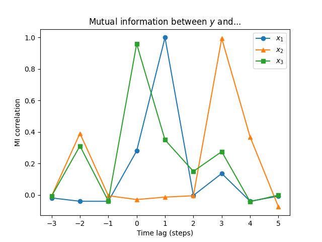
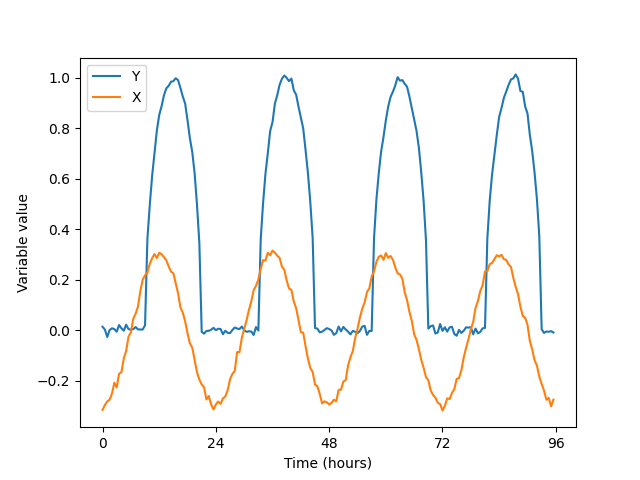

In this tutorial we will go through the various use cases of `ennemi`.
I assume that you know, at basic level, what mutual information means.
Before starting with your own projects, I strongly encourage you to still
read the [chapter on potential issues](potential-issues.md),
lest you want to discover those the hard way!

In all the examples, the method of interest is `ennemi.estimate_mi()`.
The use cases only differ in the input parameters.

**Note:**
You may get slightly different results when running the examples.
The processor model, operating system and Python/NumPy version
have subtle effects on floating point calculations.
The results should still be the same to several significant digits.


## Bivariate normal distribution

We begin by considering a two-variable normal distribution:
$$
(X, Y) \sim \mathrm{Normal}(\mu, \Sigma).
$$
We assume that both $X$ and $Y$ have unit variance.
The two variables may be correlated with the coefficient $\rho$.
In this case the covariance matrix becomes
$$
\Sigma = \begin{bmatrix}
1 & \rho\\
\rho & 1
\end{bmatrix}.
$$
There is an explicit formula for the mutual information between the two variables:
$$
\mathrm{MI}(X, Y) = -\frac 1 2 \ln \det \Sigma = -\frac 1 2 \ln (1-\rho^2).
$$

For example, if $\rho = 0.8$, we would expect $\mathrm{MI}(X, Y) \approx 0.51$.
We can test what `ennemi` outputs with the following code:
```python
from ennemi import estimate_mi
import numpy as np

rng = np.random.default_rng(1234)
rho = 0.8
cov = np.array([[1, rho], [rho, 1]])

data = rng.multivariate_normal([0, 0], cov, size=800)
x = data[:,0]
y = data[:,1]

print(estimate_mi(y, x))
```

The code prints
```
[[0.51039762]]
```
as would be expected.
The result is in double brackets because `estimate_mi()` always outputs a 2D array.
This will be discussed more below.


## Interpretation
Mutual information may have any non-negative value.
For easier interpretation, the `normalize_mi()` method converts MI to
match correlation coefficient.
To continue the above example, we could execute
```python
from ennemi import normalize_mi
print(normalize_mi(estimate_mi(y, x)))
```
to get the estimated correlation coefficient (`0.79980729`).
You can also get the same result by passing `normalize=True` to `estimate_mi()`.

The returned coefficient approximately matches the _absolute value_
of the linear correlation coefficient after suitable transformations.
(Note: it is positive also for anticorrelations!)
For example, consider the model $y = \sin(x) + \varepsilon$.
We calculate both the linear correlation and correlation from MI:
```python
from ennemi import estimate_mi, normalize_mi
import numpy as np

rng = np.random.default_rng(1234)
x = rng.normal(0.0, 3.0, size=800)
y = np.sin(x) + rng.normal(0.0, 0.5, size=800)

print(f"From MI: {normalize_mi(estimate_mi(y, x))[0,0]:.3}")
print(f"Pearson: {np.corrcoef(y, np.sin(x))[0,1]:.3}")
print(f"Pearson, untransformed: {np.corrcoef(y, x)[0,1]:.3}")
```

The two values are very close to each other.
Without the correct transformation, there is no linear correlation
between the two variables.
```
From MI: 0.824
Pearson: 0.812
Pearson, untransformed: 0.01993
```

There are some caveats to the above.
The two coefficients are theoretically equivalent only when the transformations
are monotonic.
Periodic transformations such as sine (as above) have additional requirements
on symmetry: `x` should be distributed evenly across periods.
Therefore, the returned coefficient **should be considered only approximate**.


## More variables

Let's extend the above example by adding another variable.
As you remember, the mutual information between independent variables is 0.

The `estimate_mi()` method accepts a 2D array for the `x` parameter.
In that case, it splits the array into columns $X_1$ to $X_m$,
and calculates $\mathrm{MI}(X_i, Y)$ for each $i = 1, \ldots, m$.

This interface is a shorter way of calculating the MI between several
$X$ variables and $Y$.
It may also be slightly faster, because `ennemi` computes the estimates
in parallel whenever it is beneficial.
However, this should not be confused with _multivariate mutual information_,
the MI between a set of variables.
As of this writing, `ennemi` does not support computing multivariate MI.

Here's the above example updated with a new, independent variable $Z$:
```python
from ennemi import estimate_mi
import numpy as np

rng = np.random.default_rng(1234)
rho = 0.8
cov = np.array([[1, rho], [rho, 1]])

data = rng.multivariate_normal([0, 0], cov, size=800)
x = data[:,0]
y = data[:,1]
z = rng.normal(0, 1, size=800)

# Transpose: rows are observations and columns are variables
covariates = np.asarray([x, z]).T

print(estimate_mi(y, covariates))
```

The code prints
```
[[ 0.51039762 -0.02167661]]
```
The first column gives $\mathrm{MI}(X, Y)$ and the second column $\mathrm{MI}(Z, Y)$.
As expected, the latter is very close to $0$.
Due to random uncertainty and properties of the estimation algorithm,
the result will not be exactly 0, and may even be negative.
(Negative values far from zero, including $-\infty$, are discussed in the chapter
on potential issues.)

Above, we had to transpose the array so that the rows and columns were in
correct order.
The `x` parameter is interpreted as `x[observation, variable]`.
This matches the order used by NumPy and Pandas libraries.
See below for an example of using Pandas for data import.


## Time lag

In many systems, variables are coupled with a time lag.
There may be a clear dependence between $Y(t)$ and $X(t-\Delta)$,
whereas the apparent link between $Y(t)$ and $X(t)$ may be weaker or nonexistent.

The time lag is specified by passing an integer or a list/array of integers as
the `lag` parameter to `estimate_mi()`.
The lags are applied to the $X_i$ variables and may be positive or negative
(in which case information flows from $Y$ to $X$ instead).

The $Y$ array is constrained so that it stays the same for all lags.
This is done in order to make the results comparable.
For example, if there are observations $Y(0), \ldots, Y(N-1)$
and the lags are $-1$, $0$ and $1$,
the array $Y(1), \ldots, Y(N-2)$ is compared with
$$
\begin{cases}
X(2), \ldots, X(N-1),\\
X(1), \ldots, X(N-2),\\
X(0), \ldots, X(N-3),
\end{cases}
$$
each in turn.

Let's consider a model where $Y(t) = X(t-1) + \varepsilon$,
and estimate the MI for various time lags:
```python
from ennemi import estimate_mi
import numpy as np

rng = np.random.default_rng(1234)
x = rng.gamma(1.0, 1.0, size=400)
y = np.zeros(400)
y[1:] = x[0:-1]
y += rng.normal(0, 0.01, size=400)

print(estimate_mi(y, x, lag=[1, 0, -1]))
```

The code prints:
```
[[ 3.8158148 ]
 [-0.04623529]
 [-0.00942073]]
```
which means that there is a link between $Y(t)$ and $X(t-1)$, but not
between $Y(t)$ and $X(t)$ or $X(t+1)$.


## Combining the above

In this example, we import the data set from a file using Pandas
and pass the imported data straight to `estimate_mi()`.
We calculate the MI for several time lags and plot the results with Matplotlib.

To try this example, download the [mi_example.csv](mi_example.csv) file.

```python
from ennemi import estimate_mi
import matplotlib.pyplot as plt
import numpy as np
import pandas as pd

data = pd.read_csv("mi_example.csv")
time_lags = np.arange(-3, 6)

mi = estimate_mi(data["y"], data[["x1", "x2", "x3"]], lag=time_lags)

plt.plot(time_lags, mi["x1"], label="$x_1$")
plt.plot(time_lags, mi["x2"], label="$x_2$")
plt.plot(time_lags, mi["x3"], label="$x_3$")
plt.legend()
plt.xlabel("Time lag (steps)")
plt.ylabel("Mutual information (nats)")
plt.title("Mutual information between $y$ and...")
plt.show() # or plt.savefig(...)
```

The returned array is also a Pandas data frame, with
column names matching variable names and indices matching lag values:
```
          x1        x2        x3
-3 -0.018175 -0.001715  0.026281
-2 -0.038831  0.104613  0.060727
-1 -0.039366  0.000975 -0.049848
 0  0.041131 -0.057329  1.223317
 1  3.017365 -0.021007  0.073804
 2 -0.003052 -0.020242 -0.006757
 3  0.010387  2.201044  0.047242
 4 -0.040087  0.067558 -0.063396
 5 -0.005595 -0.063550  0.025323
```


From this plot we can deduce that:
- there is a connection between $Y$ and $X_1$, but only with lag 1,
- and a slightly weaker connection between $Y$ and $X_2$, but only with lag 3,
- and a connection between $Y$ and $X_3$ without any lag.

A word of warning: in a real time series, where the data is often autocorrelated,
the peaks will not be nearly as sharp.


## Conditional mutual information

Suppose that in our previous example, we know that there is a connection
between $X_1$ and $X_2$.
We may know this from theory, or maybe by running
```python
estimate_mi(data[2], data[1], lag=2)
```
recognizing the high value, and then plotting the two variables.

Now the question is: how much additional information does $X_1$ provide when
$X_2$ is already known?
We get this by calculating the conditional mutual information.

```python
from ennemi import estimate_mi
import matplotlib.pyplot as plt
import numpy as np
import pandas as pd

data = pd.read_csv("mi_example.csv")
time_lags = np.arange(-3, 6)

mi = estimate_mi(data["y"], data[["x1", "x3"]], lag=time_lags,
                 cond=data["x2"], cond_lag=time_lags+2)
print(mi)

plt.plot(time_lags, mi["x1"], label="$x_1$")
plt.plot([], []) # Keep the colors comparable
plt.plot(time_lags, mi["x3"], label="$x_3$")
plt.legend()
plt.xlabel("Time lag (steps)")
plt.ylabel("Mutual information (nats)")
plt.title("Conditional mutual information between $y$ and...")
plt.show()
```

```
          x1        x3
-3 -0.012983 -0.034058
-2 -0.047933 -0.003288
-1 -0.020685 -0.006188
 0 -0.048229  0.615541
 1  0.493758 -0.014698
 2 -0.043362 -0.017642
 3 -0.032567 -0.010353
 4 -0.022203 -0.021783
 5 -0.027794 -0.036999
```


Now we can see that $X_3$ is actually more significant in determining $Y$ than $X_1$!
The dependence between $X_1$ and $X_2$ resulted in $X_1$ "borrowing"
some explanative power from $X_2$.

The example data was generated with
$$
\begin{align*}
X_2(t) &= \mathrm{Normal}(0.2, 4^2),\\
X_1(t) &= X_2(t-2) + \mathrm{Normal}(0, 0.2^2),\\
Y(t) &= X_1(t-1) + \mathrm{Normal}(0, 0.1^2),\\
X_3(t) &= Y(t) - X_2(t-3).
\end{align*}
$$
The reason for our result is that $X_3$ contains the full difference between
$Y$ and $X_2$ whereas there is still some random variation between $X_1$ and $Y$.

`ennemi` also supports multidimensional condition.
This is useful when there are several common explanative variables.
To specify a multivariate condition, pass a two-dimensional array as the `cond`
parameter similarly to `x`.
Instead of comparing each variable separately as with `x`, the conditional
variables will be evaluated together.


## Masking observations

Sometimes, you want to use only a subset of the observations.
This is easy to do with some array slicing unless some variables are time lagged.
The time lags are easy to get the wrong way around, and
if the subset consists of several separate parts,
the resulting array is no longer evenly spaced in time.

To make subsetting with time lags easier, `estimate_mi()` accepts a `mask` parameter.
The mask is an array (or list) of boolean values.
A observation is only used if the corresponding `mask` element is `True`.
Time lags are applied as usual to `x` and `cond` arrays.

Consider a model of two variables.
The first variable has a daily cycle.
The second variable follows the first with a time lag, but gets meaningful
values only in the daytime.



To analyze the full data set, you would execute:
```python
from ennemi import estimate_mi
import matplotlib.pyplot as plt
import numpy as np

# One observation every 30 minutes
t = np.arange(4*48) / 2
rng = np.random.default_rng(1234)
x = -0.3 * np.cos(2 * np.pi * t / 24) + rng.normal(0, 0.001, len(t))
y = np.sqrt(np.maximum(0, -np.cos(2 * np.pi * (t-3) / 24))) + rng.normal(0, 0.001, len(t))

print(estimate_mi(y, x, lag=[0, 1, 2, 3]))
```
The result is:
```
[[1.36065339]
 [1.38213486]
 [1.45658645]
 [1.46549623]]
```

To constrain to daytime observations of $Y$ only, replace the last line with
```python
mask = np.logical_and(t % 24 > 6, t % 24 < 18)
print(estimate_mi(y, x, lag=[0, 1, 2, 3], mask=mask))
```
This produces slightly larger MI values:
```
[[1.6303343 ]
 [1.72073981]
 [1.81418762]
 [1.88527594]]
```
