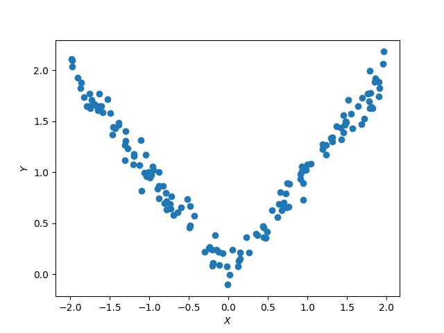

There are many textbooks and articles on entropy and mutual information,
not to forget Wikipedia.
Because of that, this page does not go into the details.
Instead, we only build/revise enough intuition necessary for using `ennemi`.

## A discrete example
You are probably familiar with _bits_, the 0s and 1s computers speak in.
There are several derivative units, like _byte_, equal to 8 bits.
With one byte, you can express $2^8 = 256$ different values.

The _entropy_ of a discrete random variable is simply
the average number of bits needed to express its value.
If the random variable has 256 equally likely values, its entropy is 8 bits.
But if the random variable is
$$
\begin{cases}
0, &\text{with probability } \frac 1 2,\\
1, \ldots, 255, &\text{with probability} \frac{1}{510},
\end{cases}
$$
the entropy is 5 bits.
This is because in half of the cases, the variable can be expressed with
just one bit: $0$.
In the rest of the cases, nine bits are necessary:
a $1$ for distinction from the first case, and eight bits for encoding the value.
(This is a simplification; the real value is slightly smaller.)

This is how data compression works.
A file can be compressed down to as many bits as it has entropy.
Each byte in a text file may represent any one of 256 values,
but only a fraction of those is used in English text.
Moreover, only some combinations of characters are used in English,
further reducing the entropy.

Mathematically, the entropy of a random variable $X$ is defined as
$$
H(X) = \mathbb E \log_2 p(x) = \sum_{x \in \Omega} p(x) \log_2 p(x).
$$

Sometimes, the natural logarithm is used instead of binary logarithm.
In this case, the unit is often called _nats_.
**The `ennemi` package always returns values in nats.**
To convert between bits and nats, apply the change-of-base formula:
$$
\mathrm{bits} = \mathrm{nats} \cdot \log_2 e.
$$

## Going continuous
If $X$ is a continuous random variable, the natural way to define its entropy is
$$
H(X) = \mathbb E \log p(x) = \int_\Omega p(x) \log p(x) \,dx.
$$
However, this definition leads to one significant difference.
Remember that continuous random variables always take on infinitely many values.
Therefore you always need an infinite number of bits to express the value.

As an example, it is easy to calculate that the uniform distribution on
the interval ${[{a}, {b}]}$ has entropy equal to $\log (b-a)$.
This means that
$$
H(\mathrm{Uniform(0, 1)}) = 0,
$$
and even more confusingly
$$
H(\mathrm{Uniform(0, 1/2)}) = -1 \text{ bits} \approx -0.69 \text{ nats}.
$$

Instead of being an _absolute_ measure of information like in the discrete case,
continuous (or differential) entropy is a _relative_ measure.
It tells that you need one coin flip less to express $\mathrm{Uniform(0, 1/2)}$
than $\mathrm{Uniform(0, 1)}$, but both are "at an infinite offset" to zero entropy.

`ennemi` can estimate the entropy of continuous random variables via the
`estimate_entropy()` method.
The variables can be one- or $n$-dimensional.

## Mutual information
Mutual information (MI) answers the question,
> If I know the value of $X$, how much is my uncertainty on $Y$ reduced?

MI is defined as
$$
\mathrm{MI}(X; Y) = H(X) + H(Y) - H(X, Y).
$$
Intuitively, if you drew a Venn diagram of the two random variables,
the mutual information would give the size of their intersection.
MI is a relative measure, and it is not affected by typical transformations
of the variables $X$ and $Y$.
(In technical terms, it is invariant on homeomorphisms.)

If, and only if, the variables $X$ and $Y$ are independent, their
mutual information is zero.
This makes MI a test for independence.
Additionally, MI is always non-negative (save for estimation errors)
and $\mathrm{MI}(X; Y) = \mathrm{MI}(Y; X)$.

MI is useful because it describes the strength of relation between two variables,
regardless of the type of relation.
For example, consider the below scatter plot:

It is pretty obvious that the $X$ and $Y$ variables are related.
Specifically, $Y$ seems to be the absolute value of $X$ added with some noise.
Yet the correlation coefficient between the two is barely 0.1,
and even that is due to random error.
This is because the Pearson coefficient is designed
only to detect linear correlations.

Because MI does not depend on the type of correlation, it is very suitable
for exploring the dependencies between variables.
The `ennemi` package is designed for this workflow:

1. Calculate the MI between $Y$ and many candidate variables.
   With time series data, various time lags may be tried.
   The methods to use are `pairwise_mi()` and then `estimate_mi()`.
2. Select the variables with highest MI for further evaluation.
3. Using MI and conditional MI, further narrow the set of variables.
4. Analyze the dependencies with scatter plots and theoretical knowledge.

The conditional MI mentioned in Step 3 slightly extends the definition:
> Given a variable $Z$, how much extra information on $Y$ I gain from $X$?

To quote the classic example, there is a positive correlation between
ice cream sales and drownings in pools.
This means that $\mathrm{MI}(\text{drownings}; \text{ice cream sales}) > 0$. 
Of course, both variables depend on the temperature, so we also have
$\mathrm{MI}(\text{drownings}; \text{temperature}) > 0$ and
$\mathrm{MI}(\text{ice cream sales}; \text{temperature}) > 0$.

To find out whether there is any link between drownings and ice cream,
we calculate the MI conditioned on temperature.
This removes the effect explained by temperature alone.
If
$$
\mathrm{MI}(\text{drownings}; \text{ice cream sales} \mid \text{temperature}) > 0,
$$
there is an actual link.
If the conditional MI is zero, the correlation is fully explained by temperature.

## The ways of estimation
The most accurate way of estimating entropy or mutual information
is to use the definition.
This gives the exact value.
Unfortunately, for this you need to know the distributions of the variables,
which is rarely the case with real-world data.
Additionally, closed-form expressions for MI are available only for some
well-behaved distributions, such as the multivariate normal distribution:
$$
\mathrm{MI}(\mathrm{Normal}(\mu, \Sigma)) = -\frac 1 2 \log(\det\Sigma).
$$

Another option is to use a discrete approximation.
Dividing the space into successively finer grids,
you should get increasingly accurate estimates of entropy and MI.
However, this method is highly dependent on the selection of the grid,
unless you have infinitely many observations.

Instead, `ennemi` uses a more reliable method.
It uses nearest-neighbor estimation of entropy, adapted for MI by
[Kraskov et al. (2004)](https://link.aps.org/doi/10.1103/PhysRevE.69.066138).
The idea is to, for each point:

1. Find the distance to the $k$'th closest neighbor.
   This distance is calculated with the $L^\infty$ norm
   (maximum of distances along each axis).
2. Find the number of neighbors within this distance along each axis.
3. Compute $\psi(n_x) + \psi(n_y)$, where $\psi$ is the digamma function.

Averaging over all the points, denoted $\langle\cdots\rangle$,
the estimated MI is then
$$
\mathrm{MI}(X; Y)
\approx \psi(N_{points}) + \psi(k) - \langle \psi(n_x) + \psi(n_y) \rangle.
$$

Low values of the parameter $k$ give lower systematic error
whereas high values of $k$ give lower statistical error.
In practice, the effect is fairly small.
Kraskov et al. suggest values between 2 and 4,
and up to $N/2$ when testing for independence.
The default value in `ennemi` is $k=3$.
